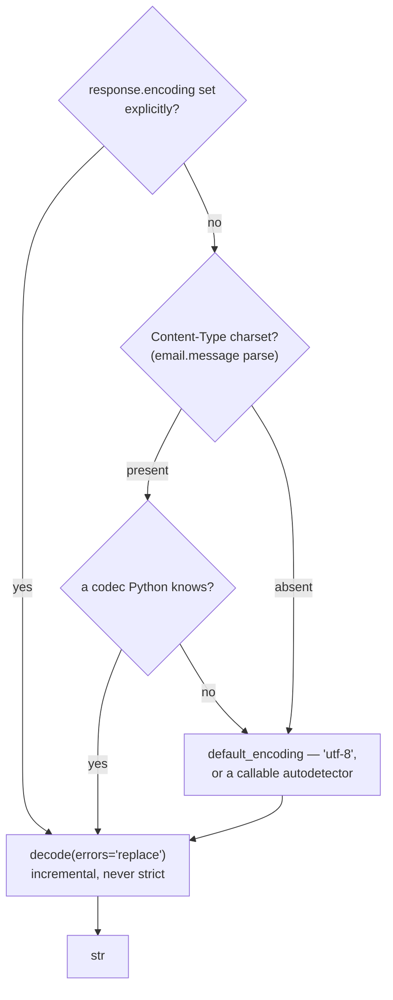
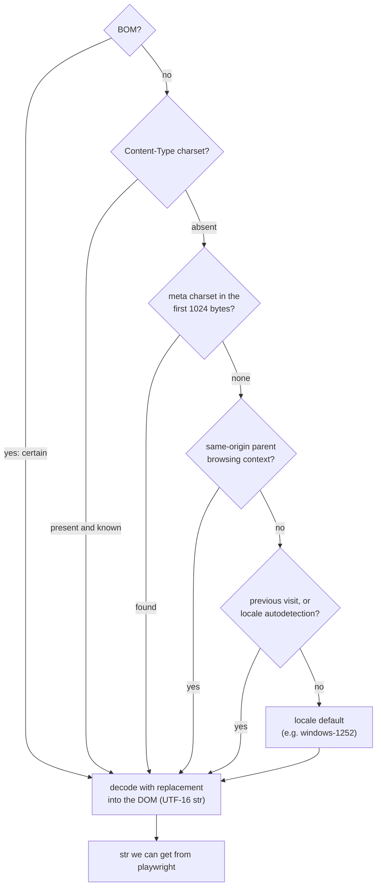
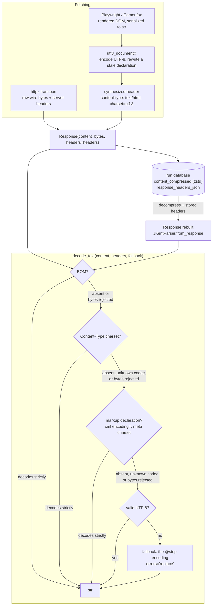

# How text is decoded and why

Httpx and Playwright are both used to fetch content, and both of them do decoding slightly differently. On top of that, lxml does its own decoding of documents when we hand it bytes. We add a small set of helper functions and config points for specifying fallback encoding when servers don't specify it, and the sensible default of utf8 fails.

We have a few goals for this system:

1. We're capturing enough information to debug encoding errors. Primarily if we get garbled text showing up, we want to know if it's something the court was handing us, or an issue with our processing.

2. We want to be able to cover cases where courts send us text encoded one way and advertised another way (say `Content-type: utf-8` in a header, but the content is actually cp1252), or not advertised at all.

3. We want to be able to view and replay original content from the DB in a variety of circumstances, without necessarily synthesizing a full response.

## How the transports handle decoding by default

### HTTPX (if we read `response.text`)

Httpx doesn't read from the doc as part of its decoding, so a
`<meta charset>` is invisible to it. Httpx also does a very permissive
`errors="replace"`, so a wrong header yields garbledygook, or
U+FFFD, and no error to let us know something failed. We store the raw content bytes (zsted)
in the requests table with headers.

### Playwright/Camoufox

This is the HTML standard's encoding sniffing algorithm, which Firefox (so
Camoufox) and Chromium both implement. It runs inside the browser, before any
jkent code exists.

Importantly, when we're using playwright, we're mostly doing it in circumstances where javascript is
adding things to the DOM, so we aren't necessarily interested in parsing the first document we get,
but the document that is being rendered after some short period of time. When we ask playwright for
that serialized DOM, we're always getting it handed to us as a string. We need to pick some encoding for it, so we pick utf8. The dom snapshot is stored with a synthesized header indicating the utf8 encoding and the first charset in the head is rewritten to prevent conflicts. Additionally, we collect the documents that are fetched as part of our browsing as incidental_requests and those don't go through the decoding pipeline of the browser, so we can use those if needed for debugging/inspection.

The edge case here would come from a case where the server responds twice with different content-type headers but the same body (md5). We judge this to be a rare enough occurence that we accept the blindspot here.

## How JKent overrides it

### Why this precedence

The order is:

1. byte-order mark

2. `Content-Type` header

3. markup declaration (`<?xml encoding=...?>`, `<meta charset>`)

4. strict UTF-8

5. `@step` encoding with replacement (default utf8).

Only the last one always succeeds. Steps 1-4 happen with strict decoding so that
we can cascade further if they fail. Steps 1-3 follow the WHATWG order the browser
uses; we had no observed data justifying a different one.

Strict decoding is where we go further than the browser: a header that names a
charset the bytes don't fit (say `charset=utf-8` over cp1252 bytes) is skipped
rather than applied with replacement, so the markup declaration, UTF-8, or the
`@step` encoding gets a chance at it.